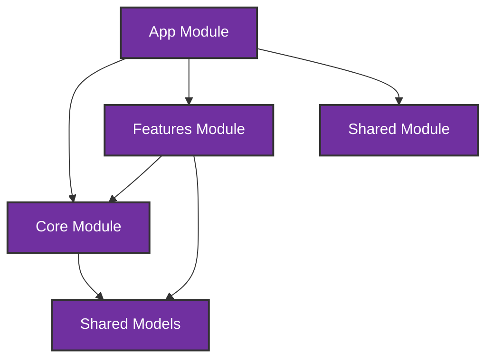
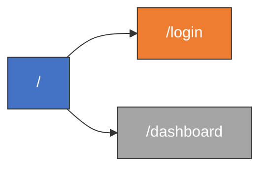

# Repository Map (Javascript)

This repository map provides a comprehensive overview of the javascript codebase structure, including component trees, class hierarchies, public interfaces, and dependency relationships.

## Architecture Overview

The application follows a modular architecture with the following main areas:

## Module Dependencies

The application is organized into logical modules with the following dependency structure:

## Routing Structure

## Code Organization by Feature

### Ocontant

---

*This repository map was automatically generated using tree-sitter code analysis.*